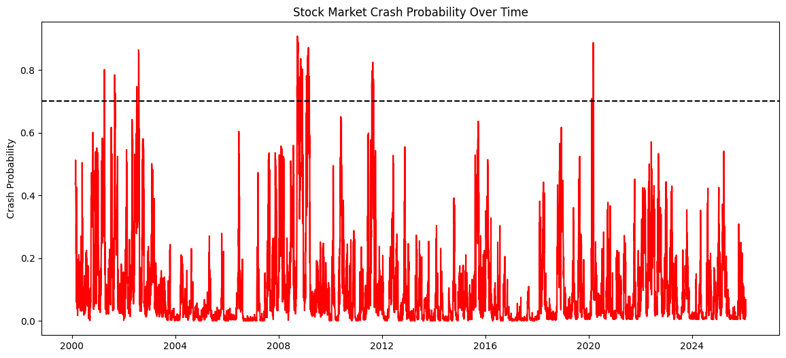

#### 📉 Stock Market Crash Detector using Machine Learning

This project detects **potential stock market crash conditions** by estimating the **probability of a significant market drop in the next 10 trading days** using historical market data and machine learning.

> ⚠️ This project focuses on **risk detection**, not exact price prediction.

---

## 🎯 Objective
To identify **crash-like market regimes** early by analyzing volatility, momentum, and trend indicators using supervised machine learning.

---

## 🧠 Methodology

1. Historical S&P 500 market data is collected using Yahoo Finance.
2. Technical indicators are extracted:
   - Daily Returns
   - Volatility
   - RSI
   - MACD
   - Bollinger Band Width
3. A **crash** is defined as:
   > A market drop of **10% or more within the next 10 trading days**
4. A **Random Forest Classifier** is trained to classify:
   - `0` → Normal Market
   - `1` → Crash Risk
5. The model outputs a **crash probability percentage** for the upcoming 10 days.

---

## 📊 Crash Risk Interpretation

| Probability Range | Interpretation |
|------------------|----------------|
| 0–10% | Very Low Risk (Stable Market) |
| 10–30% | Low Risk |
| 30–50% | Moderate Risk |
| 50–70% | High Risk |
| 70–100% | 🚨 Crash-like Conditions |

**Example Output:**

Interpretation:  
> The market is currently stable with no strong indicators of an imminent crash.

---

## 🛠️ Tech Stack
- Python
- Pandas, NumPy
- scikit-learn
- yfinance
- ta (Technical Analysis library)
- Matplotlib, Seaborn
- Jupyter Notebook

---

### 
```markdown
```bash
pip install -r requirements.txt
notebook/Crash_Detector.ipynb

## 📊 Crash Probability Visualization



